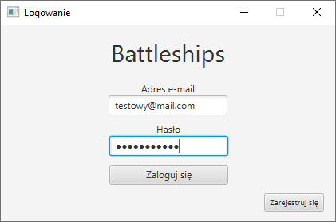
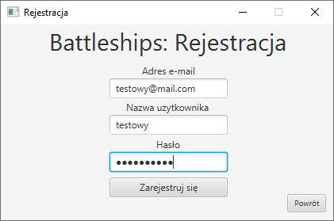
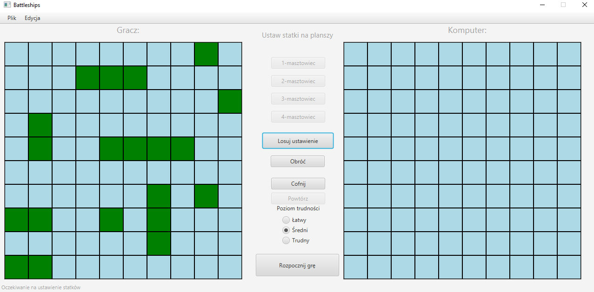
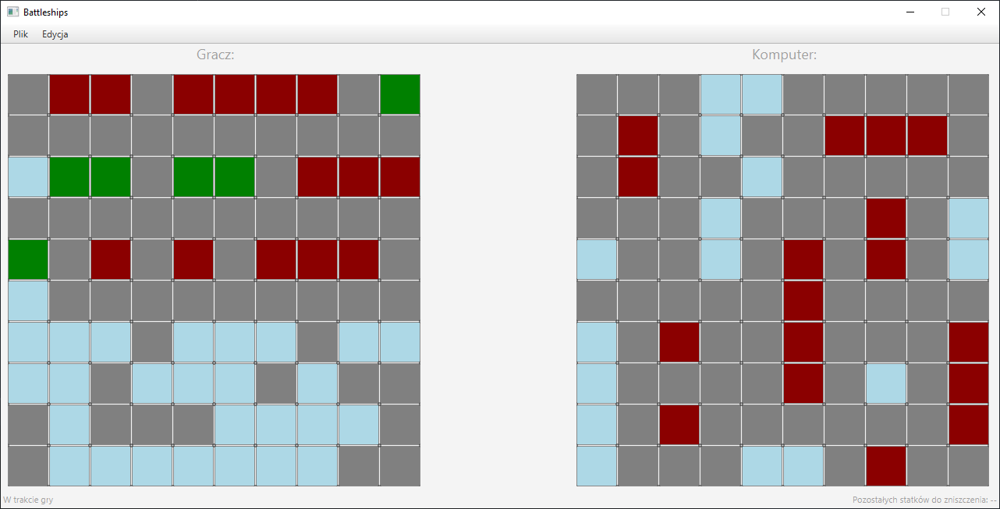
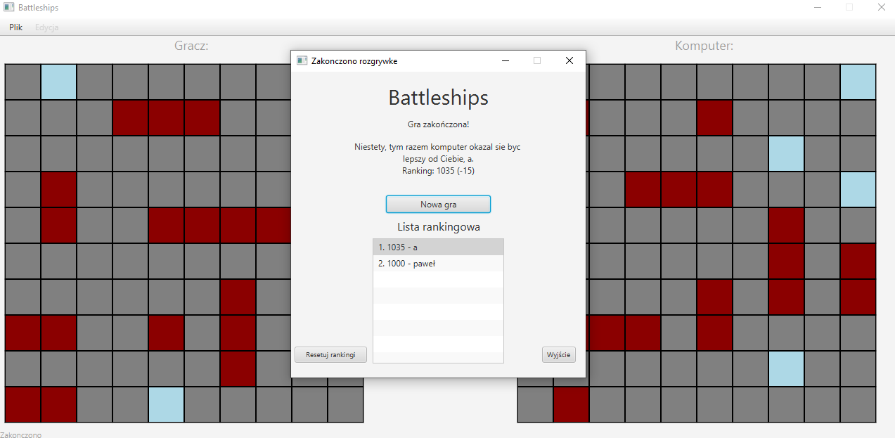

# Statki

- [Szczegółowa dokumentacja M1](docs/m1_docs.md)
- [Szczegółowa dokumentacja M2](docs/m2_docs.md)
- [Szczegółowa dokumentacja M3](docs/m3_docs.md)

## M1:

Zostały zrealizowane następujące elementy:

- Szkielet modelu aplikacji
- Główny widok gry z menu nawigacyjnym w oparciu o wzorzec `MVC`
- Możliwość wyboru i ustawiania statków na planszy wraz z detekcją kolizji, a także ich usuwanie po kliknięciu prawym przyciskiem myszy
- Możliwość cofania/powtarzania wykonanych akcji przy użyciu wzorca `Command`


## M2:

Zostały zrealizowane następujące elementy:

- Pełen przebieg rozgrywki z graczem komputerowym
- Działająca persystencja danych w oparciu o wzorzec `DAO` i bazę SQLite
- Możliwość wyboru poziomu trudności przeciwnika komputerowego (trzy warianty)
- Mechanizm autoryzacji i autentykacji użytkowników

## M3:

Zostały zrealizowane następujące elementy:

- Dodanie listy rankingowej graczy
- Wysyłanie powiadomień e-mailem o utraceniu swojej pozycji w rankingu
- Utworzono mechanizm autoryzacji użytkowników
- Dodanie tooltipów do wybranych akcji
- Generacja losowych plansz dla gracza
- Drobne usprawnienia

## Konfiguracja emailów

W celu poprawnego wysyłania emalii na maile graczy należy skonfigurować serwer STMP w pliku  emailConfig. Ponieważ serwisy ograniczają dostęp do STMP ze względu na konieczność ograniczenia spamu. Koniczne było ręczne potwierdzanie każdego maila w celu umożliwienia wysyłania maili na nie.

## Konto administratora

 W grze stworzyliśmy konto administratora, które jest dostępne od początku gry. Pozwala ono na resetowanie rankingu wszystkich użytkowników. Aby zalogować się do niego należy podczas logowania podać następujące dane

- login: admin@admin.com
- hasło: admin

## Uruchomienie programu:

W głównym katalogu projektu:

```bash
gradle run
```

Do poprawnego działania wymagana jest wersja Java w wersji >= 14 

## Zrzuty ekranu aplikacji:

### Logowanie

### Rejestracja

## Główny ekran przygotowania gry

## Rozgrywka

## Zakończenie


## Autorzy:

- Paweł Kiełbasa
- Wojciech Kosztyła
- Marcin Kozubek
- Jacek Nitychoruk

