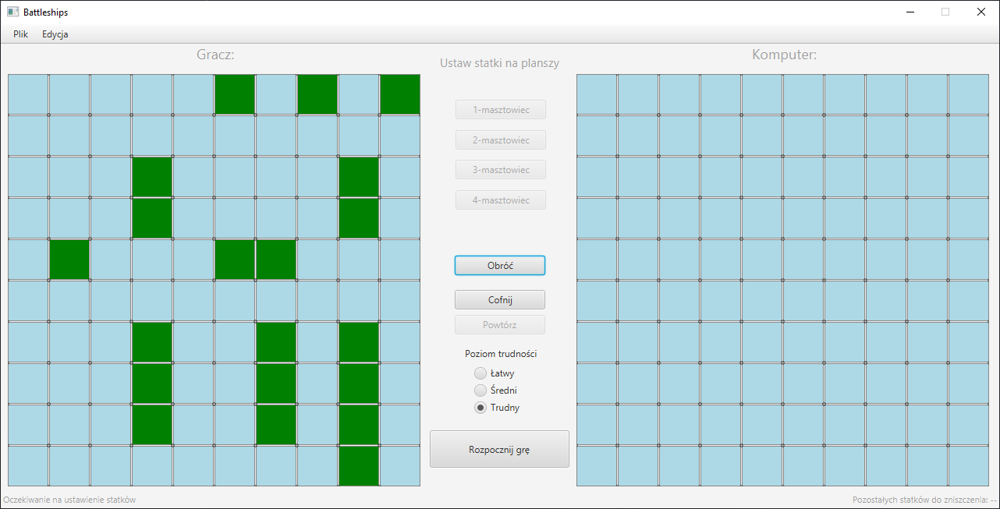

# Statki

- [Szczegółowa dokumentacja M1](docs/m1_docs.md)
- [Szczegółowa dokumentacja M2](docs/m2_docs.md)

## M1:

Zostały zrealizowane następujące elementy:

- Szkielet modelu aplikacji
- Główny widok gry z menu nawigacyjnym w oparciu o wzorzec `MVC`
- Możliwość wyboru i ustawiania statków na planszy wraz z detekcją kolizji, a także ich usuwanie po kliknięciu prawym przyciskiem myszy
- Możliwość cofania/powtarzania wykonanych akcji przy użyciu wzorca `Command`


## M2:

Zostały zrealizowane następujące elementy:

- Pełen przebieg rozgrywki z graczem komputerowym
- Działająca persystencja danych w oparciu o wzorzec `DAO` i bazę SQLite
- Możliwość wyboru poziomu trudności przeciwnika komputerowego (trzy warianty)
- Mechanizm autoryzacji i autentykacji użytkowników


## Uruchomienie programu:

W głównym katalogu projektu:

```bash
gradle run
```

Do poprawnego działania wymagana jest wersja Java w wersji >= 14 

## Zrzuty ekranu aplikacji:




## Autorzy:

- Paweł Kiełbasa
- Wojciech Kosztyła
- Marcin Kozubek
- Jacek Nitychoruk

