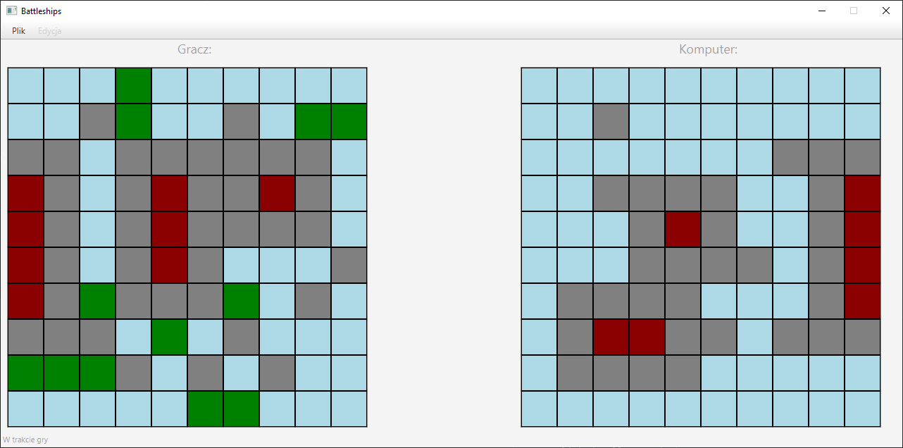

# Statki

- [Szczegółowa dokumentacja M1](m1_docs.md)
- [Szczegółowa dokumentacja M2](m2_docs.md)
- [Szczegółowa dokumentacja M3](m3_docs.md)

## M1:

Zostały zrealizowane następujące elementy:

- Szkielet modelu aplikacji
- Główny widok gry z menu nawigacyjnym w oparciu o wzorzec `MVC`
- Możliwość wyboru i ustawiania statków na planszy wraz z detekcją kolizji, a także ich usuwanie po kliknięciu prawym przyciskiem myszy
- Możliwość cofania/powtarzania wykonanych akcji przy użyciu wzorca `Command`


## M2:

Zostały zrealizowane następujące elementy:

- Pełen przebieg rozgrywki z graczem komputerowym
- Działająca persystencja danych w oparciu o wzorzec `DAO` i bazę SQLite
- Możliwość wyboru poziomu trudności przeciwnika komputerowego (trzy warianty)
- Mechanizm autoryzacji i autentykacji użytkowników

## M3:

Zostały zrealizowane następujące elementy:

- Dodanie listy rankingowej graczy
- Wysyłanie powiadomień e-mailem o rejestracji i utraceniu pierwszej pozycji w rankingu
- Mechanizm autoryzacji użytkowników - rola administratora umożliwia zerowanie listy rankingowej
- Dodanie pomocy kontekstowej (tooltipy) do wybranych akcji
- Generowanie losowych plansz dla gracza
- Usprawnienia UX/UI.


## Konto administratora

W grze stworzyliśmy konto administratora, które jest dostępne od początku gry. Pozwala ono na resetowanie rankingu wszystkich użytkowników na etapie wyświetlania listy rankingowej. Aby zalogować się do niego należy podczas logowania podać następujące dane

- login: admin@admin.com
- hasło: admin

## Uruchomienie programu:

### Konfiguracja serwera SMTP

W celu poprawnego wysyłania emalii na maile graczy należy skonfigurować serwer STMP w pliku `src\java\resources\emailConfig`. 
Przykładowa konfiguracja pliku znajduje się poniżej:

```
email = somemail@gmail.com
password = topsecretpassword
smtp_port = 587
smtp_server = smtp.gmail.com
```

### Uruchomienie
W głównym katalogu projektu:

```bash
gradle run
```

Do poprawnego działania wymagana jest wersja Java w wersji >= 14 

## Zrzuty ekranu aplikacji:

### Logowanie

### Rejestracja

## Główny ekran przygotowania gry

## Rozgrywka

## Zakończenie


## Autorzy:

- Paweł Kiełbasa
- Wojciech Kosztyła
- Marcin Kozubek
- Jacek Nitychoruk

