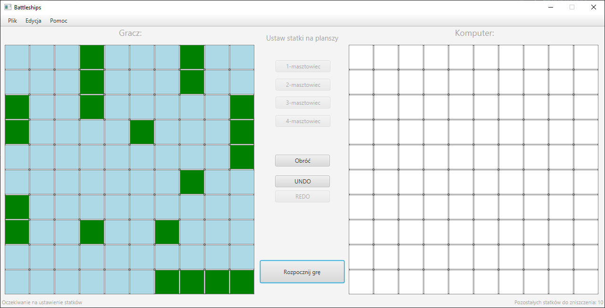
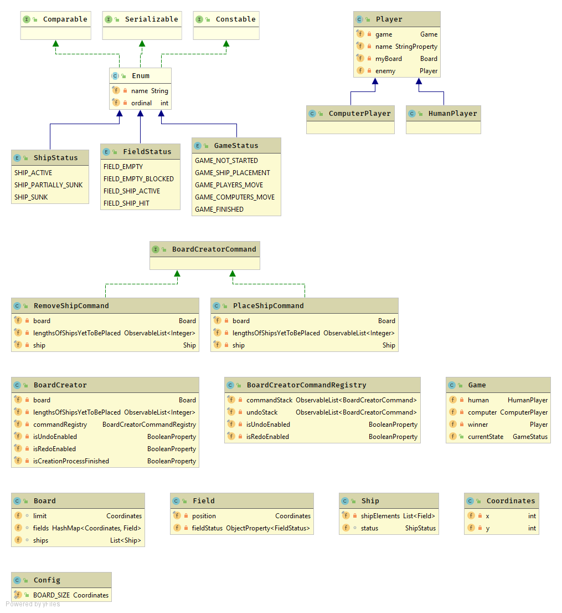

# Szczegółowa dokumentacja - Statki - m1

## Plan projektu

W naszym projekcie mamy zamiar stworzyć grę statki w języku Java z budowaniem projektu poprzez Gradle. Aplikacja będzie wolnostojąca.

Domyślna konfiguracja rozgrywki przedstawia się następująco:

* Plansza jest rozmiaru 10x10
* W każdej turze atak wykonywany jest tylko na jedno pole przeciwnika
* Gracz posiada 10 statków (1 czteromasztowy, 2 trójmasztowe, 3 dwumasztowe, 4 jednomasztowe)
* Żadne statki nie mogą ze sobą się stykać

## Wykorzystane wzorce

### GUI - Model-View-Controller

Aplikację oparliśmy o Framework JavaFX do generowania interfejsu użytkownika.

W konsekwencji tego, w aplikacji zastosowaliśmy wzorzec MVC, poprzez podział projektu na klasy stanowiące pl.edu.agh.iisg.to.battleships.model aplikacji, widok - będący konfiguracją GUI generowaną na podstawie stanu modelu, oraz kontroler reagujący na zdarzenia z widoku.

Za wykonanie widoku GUI oraz większą część kontrolera odpowiedzialny był Jacek Nitychoruk

### BoardCreator - Zastosowanie wzorca Command

Tworzeniem planszy i generowaniem statków - obecnie działającą funkcjonalnością - zajmuje się obiekt `BoardCreator`, w którym zaimplementowany został wzorzec `Command`. Dzięki temu dodawanie i usuwanie statków z planszy może być cofane/powtarzane za pomocą menu lub przycisków.

Wyżej wymienionymi funkcjonalnościami dodawania statków zajmował się Marcin Kozubek

## Model 

Modelem zajmowali się wszyscy uczestnicy projektu, z racji bardzo wczesnego jego etapu i trudności w odseparowaniu pracy poszczególnych osób. 

W projekcie umieściliśmy następujący podział na klasy:

## Kod programu

#### Implementacja planszy wraz ze statkami

W celu zwiększenia przejrzystości kodu wprowadzone zostały dodatkowe enumy określające stan statku, danego pola i gry.

Stan pola

    public enum FieldStatus {
        FIELD_EMPTY,
        FIELD_EMPTY_BLOCKED,
        FIELD_SHIP_ACTIVE,
        FIELD_SHIP_HIT
    }

Stan gry

    public enum GameStatus {
        GAME_NOT_STARTED,
        GAME_SHIP_PLACEMENT,
        GAME_PLAYERS_MOVE,
        GAME_COMPUTERS_MOVE,
        GAME_FINISHED
    }
Stan statku

    public enum ShipStatus {
        SHIP_ACTIVE,
        SHIP_PARTIALLY_SUNK,
        SHIP_SUNK
    }   

Reprezentację współrzędnych w grze rozwiązaliśmy poprzez wprowadzenie klasy `Coordinates`

    public class Coordinates {
        private int x;
        private int y;
    
        public Coordinates(int x, int y){
            this.x = x;
            this.y = y;
        }
    
        public void set(int x, int y){
            if(x >= 0 && y >= 0){
                this.x = x;
                this.y = y;
            }
        }
    
        public int getX() {
            return x;
        }
    
        public int getY() {
            return y;
        }
    
        public Coordinates add(Coordinates second){
            return new Coordinates(this.getX()+second.getX(), this.getY() + second.getY());
        }
    
        public Boolean lessOrEqual(Coordinates second){
            return this.getX() <= second.getX() && this.getY() <= second.getY();
        }
    
        public Boolean less(Coordinates second){
            return this.getX() < second.getX() && this.getY() < second.getY();
        }
    
        @Override
        public boolean equals(Object o) {
            if (this == o) return true;
            if (o == null || getClass() != o.getClass()) return false;
            Coordinates that = (Coordinates) o;
            return x == that.x &&
                    y == that.y;
        }
    
        @Override
        public int hashCode() {
            return Objects.hash(x, y);
        }
    }

Klasa Field posiadajaca oprócz współrzędnych stan pola któremu odpowiada 

    public class Field {
        private final Coordinates position;
    
        private ObjectProperty<FieldStatus> fieldStatus;
    
        public Field(Coordinates position){
            this.position = position;
            this.fieldStatus = new SimpleObjectProperty<>();
            this.setFieldStatus(FieldStatus.FIELD_EMPTY);
        }
    
        public FieldStatus getFieldStatus() {
            return fieldStatus.get();
        }
        public ObjectProperty<FieldStatus> fieldStatusProperty() {
            return fieldStatus;
        }
    
        public void setFieldStatus(FieldStatus fieldStatus) {
            this.fieldStatus.set(fieldStatus);
    
        }
    
        public Coordinates getPosition() {
            return this.position;
        }
    
    }
Na podstawie wartości tego pola jesteśmy w stanie określić czy dane miejsce jest zajmowane.

Na podstawie klasy Field jesteśmy w stanie stworzyć okręt. W naszym przypadku jego implementacja wygląda następująco.

    public class Ship {
        public enum Orientation {
            VERTICAL, HORIZONTAL;
        }
    
        private final List<Field> shipElements;
        ShipStatus status;
    
        public Ship(List<Field> shipElements){
            if(shipElements == null){
                throw new IllegalArgumentException("Ship must consist of elements");
            }
            this.shipElements = shipElements;
            this.status = ShipStatus.SHIP_ACTIVE;
        }

​    
        public Boolean isOnPosition(Coordinates position){
            for (Field field: shipElements){
                if(field.getPosition() == position){
                    return true;
                }
            }
            return false;
        }
    
        public Integer getLength(){
            return this.shipElements.size();
        }
    
        public List<Field> getShipElements() {
            return shipElements;
        }
    
    }

Orientacja statku mówi nam jak jest on ustawiony ( pionowo lub poziomo), natomiast status oznacza, czy dany statek został trafiony, zniszczony lub w ogóle nie trafiony.

Metoda `isOnPosition `wskazuje nam czy jeden z elementów statku nie znajduję się na podanej jako parametr współrzędnej.

Wszystkie statki gracza przechowujemy w jednej klasie `Board `wraz z limitem mapy oraz polami.

    public class Board {
    
        Coordinates limit;
        HashMap<Coordinates,Field> fields;
        List<Ship> ships;
    
        public Board(Coordinates boardSize){
            this.limit = boardSize;
            this.fields = new HashMap<>();
            for(int i=0; i< boardSize.getX(); i++){
                for(int j=0; j<boardSize.getY(); j++){
                    Coordinates location = new Coordinates(i, j);
                    fields.put(location, new Field(location));
                }
            }
            this.ships = new ArrayList<>();
        }
    
        public Coordinates getLimit() {
            return limit;
        }
    
        public void addShip(Ship newShip) {
            this.ships.add(newShip);
            for(var field : newShip.getShipElements()){
                field.setFieldStatus(FieldStatus.FIELD_SHIP_ACTIVE);
            }
        }
    
        public Ship getShipAtPosition(Coordinates position) {
            return ships
                .stream()
                .filter(s -> s.getShipElements().stream().map(Field::getPosition).anyMatch(p -> p.equals(position)))
                .findFirst()
                .orElse(null);
        }
    
        public void removeShip(Ship shipToBeRemoved) {
            for(var field : shipToBeRemoved.getShipElements()) {
                field.setFieldStatus(FieldStatus.FIELD_EMPTY);
            }
            this.ships.remove(shipToBeRemoved);
        }
    
        public Field getFieldOnPosition(Coordinates position){
            return this.fields.get(position);
        }
    
        public boolean areCoordsInRange(Coordinates position){
            return position.less(this.limit) && position.getX() >= 0 && position.getY() >= 0;
        }
    
        public List<Field> getFieldsAround(Field field){
            ArrayList<Field> result = new ArrayList<Field>();
            for(int x=-1; x<=1; x++){
                for(int y=-1; y<=1; y++){
                    if(x != 0 || y!= 0){
                        Coordinates toCheck = field.getPosition().add(new Coordinates(x, y));
                        if(this.areCoordsInRange(toCheck)){
                            result.add(this.getFieldOnPosition(toCheck));
                        }
    
                    }
                }
            }
            return result;
        }
    }

Funkcja `addShip() `zmienia wszystkie pola zajmowane przez dany statek na zajęte i dodaje statek do listy, `removeShip` zwalnia zajmowane pola i usuwa statek z listy, `getShipAtPosition`() szuka statku zajmującego daną pozycję a następnie go zwraca natomiast  `getFieldsAround()` zwraca listę wszystkich pól będących na planszy wokół podanego jako parametr pola.

### Implementacja gracza

W celu implementacji gracza stworzyliśmy klasę abstrakcyjną Player którą będzie wykorzystywał użytkownik, jak i komputer.

    public abstract class Player {
        private final Game game;
        
        private final StringProperty name;
        private final Board myBoard;
    
        private Player enemy;
    
        public Player(Game game, String name){
            this.game = game;
            this.name = new SimpleStringProperty(name);
            this.myBoard = new Board(Config.BOARD_SIZE); 
        }
    
        public void makeMove(Coordinates cords){
            this.game.initializeAttack(enemy, cords);
        }
    
        public Board getBoard() {
            return myBoard;
        }
    
        public Player getEnemy() {
            return enemy;
        }
    
        public void setEnemy(Player enemy) {
            this.enemy = enemy;
        }
    
        public void setName(String name) {
            this.name.set(name);
        }
    
        public String getName(){
            return this.name.getValue();
        }
    
        public StringProperty getNameProperty(){
            return this.name;
        }
    
    }
Funkcja `makeMove `wysyła do gry komunikat o próbie strzału na daną pozycję na planszy przeciwnika.

Zarówno klasy `HumanPlayer ` jak i `ComputerPlayer `rozszerzają klasę `Player`

    public class HumanPlayer extends Player{
        public HumanPlayer(Game game, String name){
            super(game, name);
        }
    }

    public class ComputerPlayer extends Player{
        public ComputerPlayer(Game game, String name){
            super(game, name);
        }
    }

W późniejszym czasie do klasy `HumanPlayer `zostanie dodany wybór pola na podstawie kliknięcia myszką, natomiast dla `ComputerPlayer `wybór będzie uzależniony od pewnego algorytmu zależnego od wyboru trudności.

Klasa Game przechowuje graczy oraz status gry

    public class Game {
        private HumanPlayer human;
        private ComputerPlayer computer;
        private Player winner;
        public GameStatus currentState;
    
        public Game(){
            this.currentState = GameStatus.GAME_NOT_STARTED;
        }
    
        public HumanPlayer getHuman() {
            return human;
        }
    
        public ComputerPlayer getComputer() {
            return computer;
        }
    
        public GameStatus getCurrentState(){
            return this.currentState;
        }
    
        public void initialize() {
            human = new HumanPlayer(this, "Gracz 1");
            computer = new ComputerPlayer(this, "T-800");
            winner = null;
            this.currentState = GameStatus.GAME_SHIP_PLACEMENT;
        }
    
        public void setCurrentState(GameStatus currentState) {
            this.currentState = currentState;
        }
    
        public void initializeAttack(Player target, Coordinates targetCoords){
    
        }
    }
Funkcja `initialize ` tworzy nam nowych graczy, z czego w późniejszej implementacji imię będzie pobierane z formularza, oraz oczekuje na ustawienie przez obu graczy swoich statków.

### Wzorzec Command

W związku z załączeniem wzorca `Command `w naszym projekcie konieczne było stworzenie interfejsu `BoardCreatorCommand`, w którym znajdowałyby się metody `execute` i `undo`.

    public interface BoardCreatorCommand {
        void execute();
    
        void undo();
    }

Klasy implementujące ten interfejs będą miały za zadanie dodawać i usuwać obiekt z planszy. Pierwszą klasą jest `PlaceShipCommand`

    public class PlaceShipCommand implements BoardCreatorCommand {
        private final Board board;
        private final ObservableList<Integer> lengthsOfShipsYetToBePlaced;
        private final Ship ship;
    
        public PlaceShipCommand(Board board, ObservableList<Integer> lengthsOfShipsYetToBePlaced, Ship ship) {
            this.board = board;
            this.lengthsOfShipsYetToBePlaced = lengthsOfShipsYetToBePlaced;
            this.ship = ship;
        }
    
        @Override
        public void execute() {
            board.addShip(ship);
    
            var indexToRemoveAt = lengthsOfShipsYetToBePlaced.indexOf(ship.getLength());
            if(indexToRemoveAt >= 0) {
                lengthsOfShipsYetToBePlaced.remove(indexToRemoveAt);
            }
        }
    
        @Override
        public void undo() {
            board.removeShip(ship);
            lengthsOfShipsYetToBePlaced.add(ship.getLength());
        }
    }

Głównymi metodami są tu `execute`, która dodaje statek do planszy i `undo`, która go usuwa.

W bardzo podobny sposób działa klasa `RemoveShipCommand `(przeciwne działanie w stosunku do kodu z `PlaceShipCommand`)

    public class RemoveShipCommand implements BoardCreatorCommand {
        private final Board board;
        private final ObservableList<Integer> lengthsOfShipsYetToBePlaced;
        private final Ship ship;
    
        public RemoveShipCommand(Board board, ObservableList<Integer> lengthsOfShipsYetToBePlaced, Ship ship) {
            this.board = board;
            this.lengthsOfShipsYetToBePlaced = lengthsOfShipsYetToBePlaced;
            this.ship = ship;
        }
    
        @Override
        public void execute() {
            board.removeShip(ship);
            lengthsOfShipsYetToBePlaced.add(ship.getLength());
        }
    
        @Override
        public void undo() {
            board.addShip(ship);
    
            var indexToRemoveAt = lengthsOfShipsYetToBePlaced.indexOf(ship.getLength());
            if(indexToRemoveAt >= 0) {
                lengthsOfShipsYetToBePlaced.remove(indexToRemoveAt);
            }
    }

W celu zarządzania kolejkami operacji do cofania/powtarzania stworzyliśmy klasę `BoardCreatorCommandRegistry`, która zapamiętuje ostatnie operacje wykonane przez użytkownika.

    public class BoardCreatorCommandRegistry {
        private final ObservableList<BoardCreatorCommand> commandStack = FXCollections.observableArrayList();
    
        private final ObservableList<BoardCreatorCommand> undoStack = FXCollections.observableArrayList();
    
        private final BooleanProperty isUndoEnabled;
        private final BooleanProperty isRedoEnabled;
    
        public BoardCreatorCommandRegistry() {
            isUndoEnabled = new SimpleBooleanProperty();
            isUndoEnabled.bind(Bindings.isNotEmpty(commandStack));
    
            isRedoEnabled = new SimpleBooleanProperty();
            isRedoEnabled.bind(Bindings.isNotEmpty(undoStack));
        }
    
        public void executeCommand(BoardCreatorCommand command) {
            command.execute();
            commandStack.add(command);
            undoStack.clear();
        }
    
        public void redo() {
            if(!undoStack.isEmpty()) {
                var command = undoStack.remove(undoStack.size() - 1);
                command.execute();
                commandStack.add(command);
            }
        }
    
        public void undo() {
            if(!commandStack.isEmpty()) {
                var command = commandStack.remove(commandStack.size() - 1);
                command.undo();
                undoStack.add(command);
            }
        }
    
        public BooleanProperty isIsRedoEnabled() {
            return isRedoEnabled;
        }
    
        public BooleanProperty isIsUndoEnabled() {
            return isUndoEnabled;
        }
    }

Aby nie wystąpił błąd ponownego dodawania nowego elementu przy wykiwywaniu operacji `undo` przy każdym wywołaniu operacji `execute` stos `undoStack `musi być czyszczony.

### Tworzenie nowej planszy
Ponieważ na starcie nie dostajemy zapełnionej statkami planszy stworzyliśmy klasę `BoardCreator `która na podstawie podanej do konstruktora ilości statków dla danej długości w formie mapy odpowiednio ustawi należyte wartości, jak również będzie dodawała i usuwała statki z planszy.

    public class BoardCreator {
    
        private final Board board;
        private final ObservableList<Integer> lengthsOfShipsYetToBePlaced;
    
        private final BoardCreatorCommandRegistry commandRegistry;
    
        private final BooleanProperty isUndoEnabled;
        private final BooleanProperty isRedoEnabled;
        private final BooleanProperty isCreationProcessFinished;
    
        /**
         * Creates a BoardCreator managing placing the ships on a NxN board with specified ships
         *
         * @param boardSize Board size given as the length of the board's edge (value 10 passed here
         *                  creates a 10x10 board to place ships on)
         * @param shipCounts Map describing sizes and counts of the ships to be placed on the board during
         *                   creation process. A key-value pair of (2, 3) in the map means that 3 ships
         *                   of length 2 will be created.
         */
        public BoardCreator(int boardSize, Map<Integer, Integer> shipCounts) {
            board = new Board(new Coordinates(boardSize, boardSize));
            commandRegistry = new BoardCreatorCommandRegistry();
            isUndoEnabled = commandRegistry.isIsUndoEnabled();
            isRedoEnabled = commandRegistry.isIsRedoEnabled();
    
            var shipLengthsToBeCreated = shipCounts
                    .entrySet()
                    .stream()
                    .map(entry -> Collections.nCopies(entry.getValue(), entry.getKey()))
                    .flatMap(List::stream)
                    .collect(Collectors.toList());
            lengthsOfShipsYetToBePlaced = FXCollections.observableList(shipLengthsToBeCreated);
    
            isCreationProcessFinished = new SimpleBooleanProperty();
            isCreationProcessFinished.bind(Bindings.isEmpty(lengthsOfShipsYetToBePlaced));
        }
    
        /**
         * @return Board on which created ships will be placed on.
         */
        public Board getBoard() {
            return board;
        }
    
        /**
         * @return Lengths of the ships that have to be placed before creation process can be finalized.
         */
        public ObservableList<Integer> getLengthsOfShipsYetToBePlaced() {
            return lengthsOfShipsYetToBePlaced;
        }
    
        public BooleanProperty getUndoEnabledProperty() {
            return isUndoEnabled;
        }
    
        public BooleanProperty getRedoEnabledProperty() {
            return isRedoEnabled;
        }
    
        /**
         * @return Property indicating whether all ships are already placed.
         */
        public BooleanProperty getCreationProcessFinishedProperty() {
            return isCreationProcessFinished;
        }
    
        /**
         * Places a ship at the given position.
         * @param shipCoords Upper right tile of the ship to be placed.
         * @param length Length of the ship to be placed.
         * @param orientation Orientation of the ship to be placed.
         * @return True if the ship was placed successfully or false if placing the ship
         * at the given place would overlap with another ship already present on the board.
         * @throws IllegalArgumentException Thrown when the ship would not fit in the board at the given place
         * or if all ships of given length have already been placed.
         */
        public boolean placeShip(
            Coordinates shipCoords,
            int length,
            Ship.Orientation orientation
        ) throws IllegalArgumentException {
            if(lengthsOfShipsYetToBePlaced.stream().noneMatch(len -> len == length)) {
                throw new IllegalArgumentException("All ships of this length are already placed.");
            }
    
            var shipFieldCoords = getFieldCoordsForShipAtPosition(shipCoords, length, orientation);
    
            if(shipFieldCoords.stream().anyMatch(coords -> !board.areCoordsInRange(coords))) {
                throw new IllegalArgumentException(String.format(
                        "Ship of length %d at position %s and orientation %s would not fit in the board",
                        length, shipCoords.toString(), orientation.toString()
                ));
            }
    
            var shipFields = shipFieldCoords
                    .stream()
                    .map(board::getFieldOnPosition)
                    .collect(Collectors.toList());
    
            var fieldsAroundShip = shipFields
                    .stream()
                    .map(board::getFieldsAround)
                    .flatMap(List::stream);
    
            var isAnyShipFieldOrFieldAroundItOccupied =
                    Stream.concat(shipFields.stream(), fieldsAroundShip)
                            .anyMatch(field -> field.getFieldStatus() == FieldStatus.FIELD_SHIP_ACTIVE);
    
            if(isAnyShipFieldOrFieldAroundItOccupied) {
                return false;
            }
    
            var command = new PlaceShipCommand(board, lengthsOfShipsYetToBePlaced, new Ship(shipFields));
            commandRegistry.executeCommand(command);
    
            return true;
        }
    
        /**
         * Removes a ship that is placed on a given position.
         * @param coords Coords of a position to remove a ship from.
         * @return True if the ship was successfully removed or false if there was
         * no ship found at the given position.
         * @throws IllegalArgumentException Thrown if given coords are not in range of the board.
         */
        public boolean removeShip(Coordinates coords) throws IllegalArgumentException {
            if(!board.areCoordsInRange(coords)) {
                throw new IllegalArgumentException(
                        String.format("Given coords %s are not in board range", coords.toString())
                );
            }
    
            var shipToBeRemoved = board.getShipAtPosition(coords);
    
            if(shipToBeRemoved == null) {
                return false;
            }
    
            var command = new RemoveShipCommand(board, lengthsOfShipsYetToBePlaced, shipToBeRemoved);
            commandRegistry.executeCommand(command);
    
            return true;
        }
    
        /**
         * Undoes last ship placement/removal action.
         */
        public void undo() {
            commandRegistry.undo();
        }
    
        /**
         * Redoes previously undone action of ship placement/removal.
         */
        public void redo() {
            commandRegistry.redo();
        }
    
        private List<Coordinates> getFieldCoordsForShipAtPosition(
                Coordinates coords,
                int length,
                Ship.Orientation orientation
        ) {
            var shipFieldsXPositions = orientation == Ship.Orientation.VERTICAL ?
                    Collections.nCopies(length, coords.getX()) :
                    IntStream.range(coords.getX(), coords.getX() + length).boxed().collect(Collectors.toList());
            var shipFieldsYPositions = orientation == Ship.Orientation.HORIZONTAL ?
                    Collections.nCopies(length, coords.getY()) :
                    IntStream.range(coords.getY(), coords.getY() + length).boxed().collect(Collectors.toList());
    
            return IntStream.range(0, length).mapToObj(i ->
                new Coordinates(shipFieldsXPositions.get(i), shipFieldsYPositions.get(i))
            ).collect(Collectors.toList());
        }
    }

Funkcja addShip działa w następujący sposób: 
1. Sprawdzenie czy brakuje statku o danej długości
2. Sprawdzenie czy statek nie wystaje poza planszę
3. Sprawdzenie czy statek nie styka sie z innym statkiem

W przypadku dodawania nowego statku do planszy stworzyliśmy pomocniczą funkcję `getFieldCoordsForShipAtPosition`, która dla danej pozycji, orientacji statku i jego długości zwraca listę pól zajmowanych przez tenże statek.

## Widok - odpowiedzialny Jacek Nitychoruk
Na podstawie listy wymagań skonstruowaliśmy następujący widok.

    <VBox prefHeight="600.0" prefWidth="1280.0" xmlns="http://javafx.com/javafx/10.0.2-internal" xmlns:fx="http://javafx.com/fxml/1" fx:pl.edu.agh.iisg.to.battleships.controller="pl.edu.agh.iisg.to.battleships.controller.BoardController">
        <children>
            <MenuBar VBox.vgrow="NEVER">
                <menus>
                    <Menu mnemonicParsing="false" text="Plik">
                        <items>
                            <MenuItem mnemonicParsing="false" text="Nowa gra" />
                            <MenuItem mnemonicParsing="false" text="Ustawienia" />
                            <SeparatorMenuItem mnemonicParsing="false" />
                            <MenuItem mnemonicParsing="false" text="Zamknij" />
                        </items>
                    </Menu>
                    <Menu mnemonicParsing="false" text="Edycja">
                        <items>
                            <MenuItem mnemonicParsing="false" onAction="#undo" text="Cofnij" />
                            <MenuItem mnemonicParsing="false" onAction="#redo" text="Powtórz" />
                        </items>
                    </Menu>
                    <Menu mnemonicParsing="false" text="Pomoc">
                        <items>
                            <MenuItem mnemonicParsing="false" text="O aplikacji" />
                        </items>
                    </Menu>
                </menus>
            </MenuBar>
            <HBox prefHeight="100.0" prefWidth="200.0">
                <children>
                    <AnchorPane prefHeight="550.0" prefWidth="550.0">
                        <children>
                            <Label fx:id="playerName" alignment="CENTER" layoutX="249.0" layoutY="1.0" style="&#10;" text="Gracz:" textAlignment="CENTER" wrapText="false" AnchorPane.leftAnchor="0.0" AnchorPane.rightAnchor="0.0" AnchorPane.topAnchor="0.0">
                                
                                    
                                
                                <textFill>
                                    <Color red="0.624" green="0.624" blue="0.624" fx:id="x8" />
                                </textFill>
                            </Label>
                            <GridPane fx:id="playerBoard" gridLinesVisible="true" layoutX="14.0" AnchorPane.bottomAnchor="7.0" AnchorPane.leftAnchor="10.0" AnchorPane.rightAnchor="10.0" AnchorPane.topAnchor="40.0">
                            </GridPane>
                        </children>
                    </AnchorPane>
                    <AnchorPane fx:id="playersBoard" prefHeight="544.0" prefWidth="179.0">
                        <children>
                            <Label fx:id="instruction" alignment="CENTER" contentDisplay="CENTER" layoutY="14.0" textAlignment="CENTER" wrapText="true" AnchorPane.leftAnchor="0.0" AnchorPane.rightAnchor="0.0" AnchorPane.topAnchor="14.0">
                                
                                    
                                
                                <textFill>
                                    <Color red="0.624" green="0.624" blue="0.624" fx:id="x2" />
                                </textFill>
                                <opaqueInsets>
                                    <Insets />
                                </opaqueInsets>
                            </Label>
                            <Button fx:id="shipPlace1" layoutX="33.0" layoutY="72.0" mnemonicParsing="false" onAction="#place1Ship" prefHeight="25.0" prefWidth="116.0" text="1-masztowiec" />
                            <Button fx:id="startGame" layoutX="9.0" layoutY="496.0" mnemonicParsing="false" prefHeight="48.0" prefWidth="188.0" text="Rozpocznij grę" AnchorPane.leftAnchor="0.0" AnchorPane.rightAnchor="0.0" />
                            <Button fx:id="shipPlace2" layoutX="33.0" layoutY="111.0" mnemonicParsing="false" onAction="#place2Ship" prefHeight="25.0" prefWidth="116.0" text="2-masztowiec" />
                            <Button fx:id="shipPlace3" layoutX="33.0" layoutY="149.0" mnemonicParsing="false" onAction="#place3Ship" prefHeight="25.0" prefWidth="116.0" text="3-masztowiec" />
                            <Button fx:id="shipPlace4" layoutX="33.0" layoutY="188.0" mnemonicParsing="false" onAction="#place4Ship" prefHeight="25.0" prefWidth="116.0" text="4-masztowiec" />
                            <Button layoutX="32.0" layoutY="272.0" mnemonicParsing="false" onAction="#toggleOrientation" prefHeight="25.0" prefWidth="116.0" text="Obróć" />
                            <Button fx:id="undoBtn" layoutX="32.0" layoutY="316.0" mnemonicParsing="false" onAction="#undo" prefHeight="25.0" prefWidth="116.0" text="UNDO" />
                            <Button fx:id="redoBtn" layoutX="32.0" layoutY="348.0" mnemonicParsing="false" onAction="#redo" prefHeight="25.0" prefWidth="116.0" text="REDO" />
                        </children>
                    </AnchorPane>
                    <AnchorPane prefHeight="550.0" prefWidth="550.0">
                        <children>
                            <Label alignment="CENTER" layoutX="249.0" layoutY="1.0" style="&#10;" text="Komputer:" textAlignment="CENTER" wrapText="false" AnchorPane.leftAnchor="0.0" AnchorPane.rightAnchor="0.0" AnchorPane.topAnchor="0.0">
                                
                                    
                                
                                <textFill>
                                    <Color red="0.624" green="0.624" blue="0.624" fx:id="x81" />
                                </textFill>
                            </Label>
                            <GridPane fx:id="computerBoard" gridLinesVisible="true" layoutX="14.0" AnchorPane.bottomAnchor="7.0" AnchorPane.leftAnchor="10.0" AnchorPane.rightAnchor="10.0" AnchorPane.topAnchor="40.0">
                            </GridPane>
                        </children>
                    </AnchorPane>
                </children>
            </HBox>
            <HBox id="HBox" alignment="CENTER_LEFT" spacing="5.0" VBox.vgrow="NEVER">
                <children>
                    <Label maxHeight="1.7976931348623157E308" prefHeight="16.0" prefWidth="653.0" text="Oczekiwanie na ustawienie statków" HBox.hgrow="ALWAYS">
                        
                            
                        
                        <textFill>
                            <Color red="0.625" green="0.625" blue="0.625" fx:id="x4" />
                        </textFill>
                    </Label>
                    <Label alignment="CENTER_RIGHT" font="$x3" prefHeight="16.0" prefWidth="657.0" text="Pozostałych statków do zniszczenia: 10" textAlignment="RIGHT" textFill="$x4" HBox.hgrow="NEVER" />
                </children>
                <padding>
                    <Insets bottom="3.0" left="3.0" right="3.0" top="3.0" />
                </padding>
            </HBox>
        </children>
    </VBox>

W przypadku stworzonego widoku dostępne jest menu z opcjami zakończenia gry, zmiany poziomu trudności, powtarzania i cofania ruchów.

W widoku wykorzystujemy kilka przycisków, w tym przyciski do wyboru statku do obecnego umieszczenia, cofania, powtarzania, zmiany orientacji statków jak i rozpoczynania gry. Przyciski te są aktywowane po spełnieniu wymagań określonych w modelu (np. przycisk "Rozpocznij grę" zosttanie aktywowany tylko wtedy gdy użykownik umieści wszystkie swoje statki na planszy).

## Controller

W związku z wykorzystaniem wzorca MVC stworzyliśmy klasę reprezentującą kontroler w naszym projekcie. Klasę tą nazwaliśmy `BoardController`. Na podstawie zdarzeń wykonanych w widoku będzie ona zmieniać pl.edu.agh.iisg.to.battleships.model naszej gry, natomiast będzie ona również generować statki na planszy.

    public class BoardController {
        private Board playersBoard;
        private BoardCreator boardCreator;
    
        private final IntegerProperty shipLength = new SimpleIntegerProperty(0);
        private final BooleanProperty isPlacingShipHorizontally = new SimpleBooleanProperty(true);
    
        public void setModel(BoardCreator boardCreator) {
            this.boardCreator = boardCreator;
            this.playersBoard = boardCreator.getBoard();
        }
    
        @FXML
        public void initialize() {
        }
    
        public void controllerInit(){
    
            int rowNum = this.playersBoard.getLimit().getY();
            int colNum = this.playersBoard.getLimit().getX();
            playerBoard.setHgap(3);
            playerBoard.setVgap(3);
            for(int row = 0; row < rowNum; row++){
                for(int col = 0; col < colNum; col++){
                    Rectangle rec = new Rectangle();
                    rec.setWidth(50);
                    rec.setHeight(50);
                    rec.setFill(Color.WHITE);
                    rec.setOnMouseClicked(this::clickGrid);
                    GridPane.setRowIndex(rec, row);
                    GridPane.setColumnIndex(rec, col);
                    Field field = this.playersBoard.getFieldOnPosition(new Coordinates(row, col));
                    rec.fillProperty().bind(
                            EasyBind.map(field.fieldStatusProperty(), this::calculateFieldColor));
                    playerBoard.add(rec, row, col);
                }
            }
    
            computerBoard.setHgap(3);
            computerBoard.setVgap(3);
            for(int row = 0; row < rowNum; row++){
                for(int col = 0; col < colNum; col++){
                    Rectangle rec = new Rectangle();
                    rec.setWidth(50);
                    rec.setHeight(50);
                    rec.setFill(Color.WHITE);
                    GridPane.setRowIndex(rec, row);
                    GridPane.setColumnIndex(rec, col);
                    computerBoard.add(rec, row, col);
                }
            }
    
            instruction.textProperty().bind(Bindings.createStringBinding(() -> {
                if(shipLength.get() <= 0) {
                    return "Ustaw statki na planszy";
                }
                return String.format(
                        "Ustawiam %d-masztowiec %s",
                        shipLength.get(), isPlacingShipHorizontally.get() ? "poziomo" : "pionowo"
                );
            }, shipLength, isPlacingShipHorizontally));
    
            setupShipButtonEnabled(shipPlace1, 1);
            setupShipButtonEnabled(shipPlace2, 2);
            setupShipButtonEnabled(shipPlace3, 3);
            setupShipButtonEnabled(shipPlace4, 4);
            startGame.disableProperty().bind(Bindings.not(boardCreator.getCreationProcessFinishedProperty()));
            undoBtn.disableProperty().bind(Bindings.not(boardCreator.getUndoEnabledProperty()));
            redoBtn.disableProperty().bind(Bindings.not(boardCreator.getRedoEnabledProperty()));
        }
    
        private Paint calculateFieldColor(FieldStatus fieldStatus){
            switch (fieldStatus) {
                case FIELD_EMPTY -> {
                    return Color.LIGHTBLUE;
                }
                case FIELD_EMPTY_BLOCKED -> {
                    return Color.GREY;
                }
                case FIELD_SHIP_ACTIVE -> {
                    return Color.GREEN;
                }
                case FIELD_SHIP_HIT -> {
                    return Color.DARKRED;
                }
                default -> {
                    return Color.WHITE;
                }
            }
        }
    
        @FXML
        public void place1Ship(){
            shipLength.setValue(1);
        }
    
        @FXML
        public void place2Ship(){
            shipLength.setValue(2);
        }
        @FXML
        public void place3Ship(){
            shipLength.setValue(3);
        }
        @FXML
        public void place4Ship(){
            shipLength.setValue(4);
        }
    
        @FXML
        public void toggleOrientation() {
            isPlacingShipHorizontally.setValue(!isPlacingShipHorizontally.get());
        }
    
        @FXML
        public void undo(){
            boardCreator.undo();
        }
    
        @FXML
        public void redo(){
            boardCreator.redo();
        }
    
        @FXML
        Label playerName;
    
        @FXML
        Label instruction;
    
        @FXML
        GridPane playerBoard;
    
        @FXML
        GridPane computerBoard;
    
        @FXML
        Button shipPlace1;
        @FXML
        Button shipPlace2;
        @FXML
        Button shipPlace3;
        @FXML
        Button shipPlace4;
        @FXML
        Button startGame;
        @FXML
        Button undoBtn;
        @FXML
        Button redoBtn;
    
        public void clickGrid(MouseEvent event) {
    
            Node clickedNode = event.getPickResult().getIntersectedNode();
            Integer colIndex = GridPane.getColumnIndex(clickedNode);
            Integer rowIndex = GridPane.getRowIndex(clickedNode);
            System.out.println("Mouse clicked cell: " + colIndex + " And: " + rowIndex);
    
            var coords = new Coordinates(colIndex, rowIndex);
            try {
                if(event.getButton() == MouseButton.SECONDARY) {
                    boardCreator.removeShip(coords);
                } else {
                    if(shipLength.get() > 0) {
                        boardCreator.placeShip(
                            coords,
                            shipLength.get(),
                            isPlacingShipHorizontally.get() ? Ship.Orientation.HORIZONTAL : Ship.Orientation.VERTICAL
                        );
                        if(boardCreator.getLengthsOfShipsYetToBePlaced().stream().noneMatch(it -> it == shipLength.get())) {
                            shipLength.setValue(0);
                        }
                    }
                }
            } catch (IllegalArgumentException e) {
                System.out.println(e.getMessage());
            }
        }
    
        private void setupShipButtonEnabled(Button button, int shipLength) {
            button.disableProperty().bind(Bindings.createBooleanBinding(
                () -> boardCreator.getLengthsOfShipsYetToBePlaced().stream().noneMatch(it -> it == shipLength),
                boardCreator.getLengthsOfShipsYetToBePlaced()
            ));
        }
    }

Funkcja `controllerInit `rysuje nam układ statków gracza i komputera korzystając z pola `fieldStatus `w klasie `Field`, jak również dodaję do każdego pola planszy gracza obsługę akcji kliknięcia. 

W celu dodawania statków poprzez klikniecie na planszę stworzyliśmy funkcję `clickGrid`, która jeśli potrzeba dodać statek o danej długości zainicjalizuję funkcję `placeShip `z klasy `BoardCreator`.

Aby umożliwić dezaktywację przycisków dodawania statków stworzyliśmy pomocniczą funkcję `setupShipButtonEnabled`, która dezaktywuje przycisk jeśli ilość statków o danej długości jest prawidłowa.

## Klasa pl.edu.agh.iisg.to.battleships.Main
W klasie tej zostaje uruchomiona gra z podanymi w mapie statkami 

    public class pl.edu.agh.iisg.to.battleships.Main extends Application {
    
        @Override
        public void start(Stage primaryStage) throws Exception {
            try {
                Game game = new Game();
                game.initialize();
    
                var shipCounts = Map.ofEntries(
                    Map.entry(1, 4),
                    Map.entry(2, 3),
                    Map.entry(3, 2),
                    Map.entry(4, 1)
                );
                var boardCreator = new BoardCreator(Config.BOARD_SIZE.getX(), shipCounts);

​    
                // load layout from FXML file
                var loader = new FXMLLoader();
                loader.setLocation(pl.edu.agh.iisg.to.battleships.Main.class.getResource("view/mainView.fxml"));
                VBox rootLayout = loader.load();
                BoardController pl.edu.agh.iisg.to.battleships.controller = loader.getController();
                pl.edu.agh.iisg.to.battleships.controller.setModel(boardCreator);
                pl.edu.agh.iisg.to.battleships.controller.controllerInit();
                
                // add layout to a scene and show them all
                configureStage(primaryStage, rootLayout);
                primaryStage.setResizable(false);
                primaryStage.show();

​    
            } catch (IOException e) {
                // don't do this in common apps
                e.printStackTrace();
            }
        }
    
        private void configureStage(Stage primaryStage, VBox rootLayout) {
            var scene = new Scene(rootLayout);
            primaryStage.setScene(scene);
            primaryStage.setTitle("Battleships");
        }
    }
