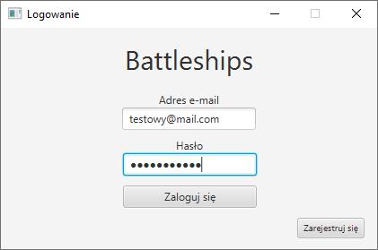

# Dokumentacja - m2

## Przeprowadzenie rozgrywki

Po uruchomieniu gry, tworzony jest obiekt gracza komputerowego w zależności od ustawionego poziomu trudności - domyślnie średniego. Gracze naprzemiennie wykonują ruchy aż do momentu, gdy wszystkie statki któregoś z nich zostały zatopione.

Wynik rozgrywki zapisywany jest do bazy danych i będzie uwzględniany w statystykach użytkownika.

Osobą odpowiedzialną za połączenie poszcególnych etapów rozgrywki był **Marcin Kozubek**.

## Persystencja danych - Hibernate, SQLite, wzorzec DAO 

W aplikacji zachodzi potrzeba przechowania danych o użytkownikach (dane do logowania, mające na celu uniemożliwienie "podszywania" się pod gracza), oraz rozegranych grach (wyniki i dane rozgrywek potrzebne do statystyk).

W tym celu aplikacja korzysta z bazy danych SQLite przechowywanej w pliku `*.db`. W bazie znajdują się dwie tabele:

- Użytkownicy (Players)
- Rozgrywki (Games)

Realizacja połączenia z bazą została wykonana przy pomocy frameworka **Hibernate**, oraz wzorca projektowego **DAO (Data Access Object)**. Zastosowane rozwiązanie, choć może nie należy do najprostszych, umożliwia ewentualną migrację bazy z danymi do innego (np. sieciowego) rozwiązania.

Na obiektach przechowywanych w bazie danych można wywoływać następujące funkcje:

- `void update(T object)`
- `void save(T object)`

W przypadku dostępu do danych o użytkownikach, dodatkowa obecna funkcjonalność sprowadza się do wykonywania operacji przez następujące funkcje:

- `Optional<Player> create(String name, String mail, String password)`
- `Optional<HumanPlayer> findByMail(String mail)`

Rozgrywki natomiast możemy wyszukiwać korzystając z funkcji:

- `Optional<Game> findById(Long id)`

### Pierwsza realizacja bazy danych - tabele graczy i gier

Za część związaną z persystencją odpowiedzialny był **Jacek Nitychoruk**.

## AI - implementacja poziomy trudności

Gracz komputerowy może wykonywać operacje działając w jednym z trzech poziomów trudności:

- **Łatwy** - komputer wykonuje ruchy całkowicie losowo.
- **Średni** - komputer wykonuje ruchy losowo do momentu trafienia w statek. Następnie próbuje go w całości zatopić. 
- **Trudny** - komputer w każdym ruchu oblicza współczynnik dla każdego pola oznaczający ile jest możliwości poprawnego ustawienia statków (w obecnym stanie gry) przykrywających dane pole. Wybiera pole z największym współczynnikiem, co powinno statystycznie zapewnić mu przewagę nad człowiekiem.

Każdemu poziomowi trudności odpowiada klasa implementująca interfejs `AI`, która pozwala wywołać metodę `getNextAttackPosition(Board enemyBoard)`, obliczającą cel następnego ataku.

Implementacją logiki działania AI zajmował się **Wojciech Kosztyła**.

## Autoryzacja i autentykacja

Użytkownik po uruchomieniu aplikacji musi zalogować się, lub utworzyć nowe konto, aby uruchomić grę. W tym celu aplikacja łączy się z bazą danych i pobiera informacje o użytkowniku weryfikując podane hasło.

Hasło haszowane jest w bazie bardzo silnym algorytmem **Bcrypt** przy użyciu bibliotecznej funkcji z frameworka Spring, co zapewnia maksymalne bezpieczeństwo.

W programie sprawdzane jest, czy użytkownik wprowadził wszystkie wymagane do rejestracji i logowania dane.

### Logowanie użytkowników

### Rejestracja użytkowników

Odpowiedzialny za mechanizm logowania i rejestracji był **Jacek Nitychoruk**

