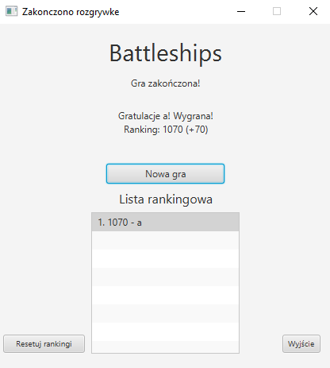
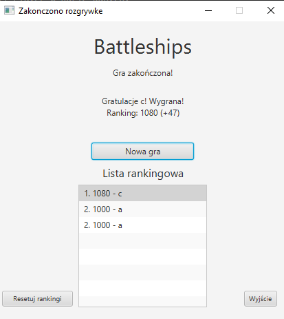
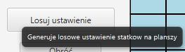
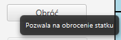
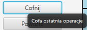
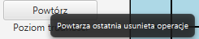
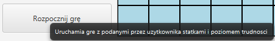
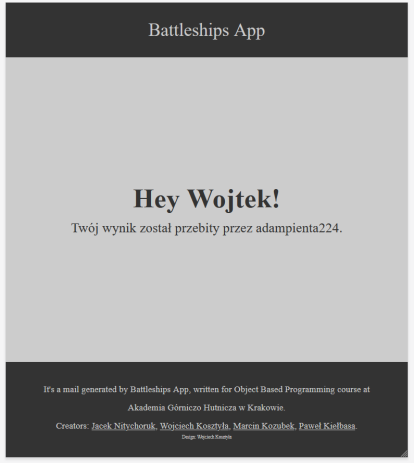
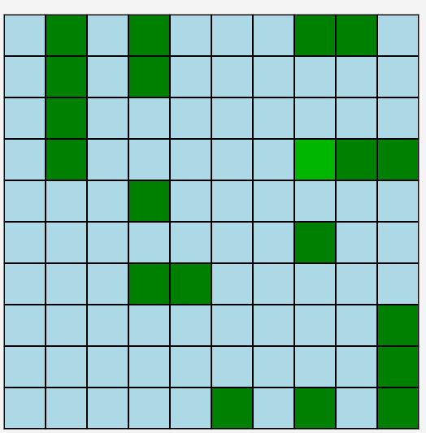

# Dokumentacja - m3

## Wprowadzenie rankingu

Po zakończeniu gry, przedstawiany jest ekran podsumowujący rozgrywkę, na którym zamieszczono obecną ilość punktów, ich zmianę oraz ranking.

Ponieważ przy porażce punkty gracza są odejmowane postanowiliśmy, że początkowo każdy gracz będzie miał 1000 punktów. Oprócz tego dodaliśmy możliwość resetowania liczby punktów dla wszystkich graczy. Ranking jest zmieniany w podobny sposób do rankingu ELO.

Ranking każdego gracza jest przechowywany w tabeli Player w bazie danych.

Obsługa rankingu została zrealizowana przez przez **Jacka Nitychoruka**.

### Widok po zakończeniu gry

### Ekran porażki

### Zakończenie gry na poziomie łatwym

## Dodanie tooltipów z pomocą kontekstową

W widoku dodaliśmy do przycisków tooltipy z informacjami o tym, co wykonują. W tym celu skorzystaliśmy z dostępnej w bibliotece JavaFX klasie Tooltip, które podłączyliśmy do przycisków.

Za tą część odpowiedzialny był **Paweł Kiełbasa**.

### Tooltip do losowania planszy

### Tooltip do obracania statku

### Tooltip do cofania operacjii

### Tooltip do powtarzania operacji

### Tooltip do uruchomienia gry

## Stworzenie usługi wysyłania maile do użytkownika

Do wysyłania maili wykorzystaliśmy protokół SMTP oraz bibliotekę JavaMail. Maile wysyłane są każdorazowo przy rejestracji nowego użytkownika oraz przy byciu pobitym przez innego gracza. Ze względu na mocne spowolnienie działania programu przez tą funkcję postanowiliśmy wykonywać ją w osobnym wątku. Oprócz tego usunęliśmy wszystkie polskie znaki ze względu na brak obsługi ich.

Za stworzenie kodu do wysyłania maili odpowiedzialny był **Wojciech Kosztyła**.

### Przykładowy mail z informacją o byciu pobitym

## Dodanie możliwości losowego wybrania położenia statków

Do głównego ekranu gry dodaliśmy przycisk generujący nam losowe rozmieszczenie statków gracza na planszy. W tym przypadku główne metody znajdują się w klasie BoardInitializer, która pozwala nam na stworzenie statku o dostępnej i losowej długości w dostępnym miejscu.

Odpowiedzialny za te funkcje był **Jacek Nitychoruk**.

### Przykładowo wygenerowana losowa plansza

## Wprowadzenie mechanizmu uprawnień

W grze dodaliśmy mechanizm uprawnień, w którym to admin będzie miał możliwość resetowania listy rankingowej. Pozostali gracze nie będą mieli dostępnej tej funkcji.

Odpowiedzialny za tę funkcje był **Marcin Kozubek**. 

## Dodanie obsługi gry myszką

W widoku początkowym gry dodaliśmy nowe opcje sterowania myszką:

- LPM : umieszcza statek na wskazanej pozycji
- ŚPM: zmienia orientację umieszczanego statku
- PPM: usuwa statek zajmujący konkretną pozycję 

Odpowiedzialny za te funkcje był **Jacek Nitychoruk**.

## Dodanie wizualizacji obecnie umieszczanego statku

Aby poprawić identyfikację, gdzie stawiany jest statek dodaliśmy wyświetlanie pozycji statku. Aby to wykonać musieliśmy stworzyć funkcję odświeżającą planszę gracza.

Odpowiedzialny za te funkcje był **Jacek Nitychoruk**.

## Efekt końcowy

