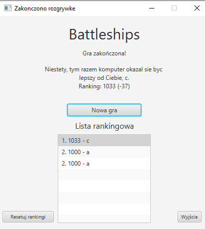

# Dokumentacja - m3

## Wprowadzenie rankingu

Po zakończeniu gry, przedstawiany jest ekran podsumuwujący rozgrywkę, na którym zamieszczono obecną ilość punktów, ich zmianę oraz ranking.

Ponieważ przy porażce punkty gracza są odejmowane postanowiliśmy, że początko każdy gracz będzie miał 1000 punktów. Oprócz tego dodaliśmy możliwość resetowania liczby punktów dla wszystkich graczy.

Ranking każdego gracza jest przechowwywany w tabeli Player w bazie danych.

Obsługa rankingu została zrealizowanan przez przez **Jacka Nitychoruka**.

### Widok po zakończeniu gry

### Ekran porażki

### Zakończenie gry na poziomie łatwym

### Zakończenie gry na poziomie średnim

### Zakończenie gry na poziomie trudnym

## Dodanie tooltipów z pomocą kontekstową

W widoku dodaliśmy do przycisków tooltipy z informacjami o tym, co wykonują. W tym celu skorzystaliśmy z dostępnej w bibliotece JavaFX klasie Tooltip, które podłączyliśmy do przycisków.

Za tą część odpowiedzialny był **Paweł Kiełbasa**.

### Tooltip do losowania planszy

### Tooltip do obracania statku

### Tooltip do cofania operacjii

### Tooltip do powtarzania operacji

### Tooltip do uruchomienia gry

## Stworzanie usługi wysyłania maily do użytkownika

W naszej grze przyjeliśmy założenie, że mail zostaje wysłany do wszystkich użytkowników, którzy zostali pobici przez danego gracza w rozegranej grze. Do wysyłania maili wykorzystaliśmy protokół SMTP. Ze wzgledu na mocne spowolnienie działania programu przez tą funkcję postanowiliśmy wykonywać ją w osobnym watku. Oprócz tego usunęliśmy wszystkie polskie znaki ze względu na brak obsługi ich.

Za stworzenie kodu do wysyłania maili odpowiedzialny był **Wojciech Kosztyła**.

### Przykładowy mail z informacją o byciu pobitym

## Dodanie możliwości losowego wybrania położenia statków

Do głownego ekranu gry dodaliśmy przycisk generujący nam losowe rozmieszczenie statków gracza na planszy. W tym przypadku główne metody znajdują się w klasie BoardInitializer, która pozwala nam na storzenie statku o dostępnej i losowej długości w dostępnym miejscu.

Odpowiedzialny za te funkcje był **Jacek Nitychoruk**.

### Przykładowo wygenerowana losowa plansza

## Dodanie obsługi gry myszką

Aby ułatwić korzystanie z gry, do przycisków na myszcze dodaliśmy dwie funkcje: środkowy przycisk powoduje obrócenie wybranego staku natomiast prawy przycisk usuwa statek na który najechaliśmy.

Odpowiedzialny za te funkcje był **Jacek Nitychoruk**.

## Dodanie wizualizacji obecnie umieszczanego statku

Aby poprawić identyfikację, gdzie stawiany jest statek dodaliśmy wyświetlanie pozycji statku. Aby to wykonać musieliśmy stworzyć funcję odświeżającą planszę gracza.

Odpowiedzialny za te funkcje był **Jacek Nitychoruk**.
